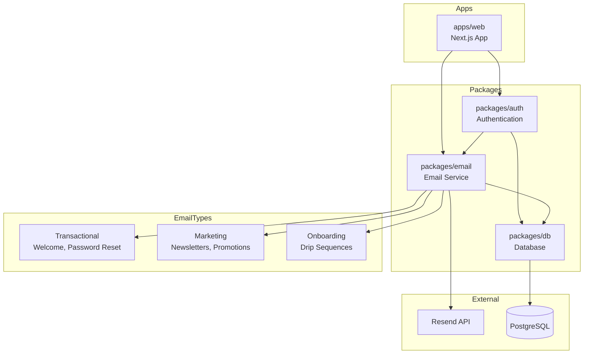

# Email Campaign System Technical Specification

## Executive Summary

This document outlines the architecture and implementation plan for a comprehensive email campaign system for Resumio. The system will support transactional emails, marketing campaigns, newsletters, and onboarding sequences using react-email for type-safe templates and Resend as the email provider.

---

## 1. Email Provider Recommendation

### Recommended: Resend

After evaluating multiple providers, **Resend** is the recommended choice for Resumio's launch phase.

#### Comparison Matrix

| Provider | Free Tier | Strengths | Weaknesses | Best For |
|----------|-----------|-----------|------------|----------|
| **Resend** | 100 emails/day | Modern API, excellent DX, react-email integration, good deliverability | Newer player, smaller ecosystem | Startups, SaaS, transactional |
| SendGrid | 100 emails/day | Mature, extensive features, good deliverability | Complex API, pricing jumps | Enterprise, high volume |
| Postmark | 100 emails/month | Fast delivery, excellent transactional focus | Expensive at scale, limited marketing features | Pure transactional |
| AWS SES | 62,000 emails/month | Cheapest at scale, reliable | Complex setup, no built-in templates, steep learning curve | High volume, AWS ecosystem |
| Brevo | 300 emails/day | Good free tier, marketing features | UI can be clunky, deliverability issues | Marketing-focused |
| Loops | 1,000 emails/month | Modern SaaS focus, great onboarding, good free tier | Newer, smaller feature set | SaaS onboarding |

#### Why Resend?

1. **Developer Experience**: Simple, clean API that aligns with modern development practices
2. **React-Email Native**: First-class support for react-email templates
3. **Deliverability**: Good reputation for inbox placement
4. **Free Tier**: 100 emails/day (3,000/month) - sufficient for launch phase
5. **Growth Path**: Reasonable pricing as volume scales
6. **TypeScript First**: Excellent type definitions
7. **Modern Dashboard**: Clean UI for monitoring and analytics

#### Alternative Consideration: Loops

If onboarding sequences and SaaS-specific features are a priority, **Loops** is a strong alternative with:
- 1,000 emails/month free tier
- Built-in waitlist management
- Pre-built SaaS email templates
- Better analytics for user journeys

However, Resend's flexibility and react-email integration make it the better foundation.

---

## 2. System Architecture

### Package Structure

```
packages/
├── email/                    # NEW: Email package
│   ├── package.json
│   ├── tsconfig.json
│   ├── src/
│   │   ├── index.ts          # Main exports
│   │   ├── client.ts         # Resend client configuration
│   │   ├── templates/        # React-email templates
│   │   │   ├── index.ts
│   │   │   ├── welcome.tsx
│   │   │   ├── password-reset.tsx
│   │   │   ├── newsletter.tsx
│   │   │   ├── onboarding/
│   │   │   │   ├── day-1.tsx
│   │   │   │   ├── day-3.tsx
│   │   │   │   └── day-7.tsx
│   │   │   └── components/
│   │   │       ├── layout.tsx
│   │   │       ├── button.tsx
│   │   │       └── footer.tsx
│   │   ├── campaigns/        # Campaign management
│   │   │   ├── index.ts
│   │   │   └── manager.ts
│   │   └── types.ts          # Shared types
│   └── static/               # Static assets for emails
├── db/                       # EXISTING: Database schemas
│   └── src/
│       └── schema/
│           ├── email.ts      # NEW: Email tables
│           └── index.ts      # UPDATED: Export email schemas
└── auth/                     # EXISTING: Authentication
    └── src/
        └── index.ts          # UPDATED: Trigger welcome email
```

### Architecture Diagram



---

## 3. Database Schema

### New Tables

Add to [`packages/db/src/schema/email.ts`](packages/db/src/schema/email.ts):

```typescript
import { relations } from "drizzle-orm";
import {
  boolean,
  index,
  integer,
  jsonb,
  pgEnum,
  pgTable,
  text,
  timestamp,
} from "drizzle-orm/pg-core";
import { nanoid } from "nanoid";
import { user } from "./auth";

// Enums
export const emailTypeEnum = pgEnum("email_type", [
  "transactional",
  "marketing",
  "newsletter",
  "onboarding",
]);

export const emailStatusEnum = pgEnum("email_status", [
  "pending",
  "sent",
  "delivered",
  "bounced",
  "complained",
  "opened",
  "clicked",
]);

export const campaignStatusEnum = pgEnum("campaign_status", [
  "draft",
  "scheduled",
  "sending",
  "sent",
  "paused",
  "cancelled",
]);

// Email Templates Table
export const emailTemplate = pgTable(
  "email_template",
  {
    id: text("id")
      .primaryKey()
      .$defaultFn(() => nanoid()),
    name: text("name").notNull(),
    slug: text("slug").notNull().unique(),
    description: text("description"),
    type: emailTypeEnum("type").notNull().default("transactional"),
    subject: text("subject").notNull(),
    content: jsonb("content").$type<{
      reactComponent: string;
      variables: string[];
    }>(),
    isActive: boolean("is_active").default(true).notNull(),
    createdAt: timestamp("created_at").defaultNow().notNull(),
    updatedAt: timestamp("updated_at")
      .defaultNow()
      .$onUpdate(() => new Date())
      .notNull(),
  },
  (table) => [index("email_template_slug_idx").on(table.slug)],
);

// Email Campaigns Table
export const emailCampaign = pgTable(
  "email_campaign",
  {
    id: text("id")
      .primaryKey()
      .$defaultFn(() => nanoid()),
    name: text("name").notNull(),
    description: text("description"),
    templateId: text("template_id").references(() => emailTemplate.id),
    status: campaignStatusEnum("status").notNull().default("draft"),
    subject: text("subject").notNull(),
    fromName: text("from_name").notNull().default("Resumio"),
    fromEmail: text("from_email").notNull().default("hello@resumio.io"),
    scheduledAt: timestamp("scheduled_at"),
    sentAt: timestamp("sent_at"),
    totalRecipients: integer("total_recipients").default(0),
    sentCount: integer("sent_count").default(0),
    openCount: integer("open_count").default(0),
    clickCount: integer("click_count").default(0),
    createdBy: text("created_by").references(() => user.id),
    createdAt: timestamp("created_at").defaultNow().notNull(),
    updatedAt: timestamp("updated_at")
      .defaultNow()
      .$onUpdate(() => new Date())
      .notNull(),
  },
  (table) => [index("email_campaign_status_idx").on(table.status)],
);

// Email Sends Table (Individual email tracking)
export const emailSend = pgTable(
  "email_send",
  {
    id: text("id")
      .primaryKey()
      .$defaultFn(() => nanoid()),
    userId: text("user_id")
      .notNull()
      .references(() => user.id, { onDelete: "cascade" }),
    campaignId: text("campaign_id").references(() => emailCampaign.id, {
      onDelete: "set null",
    }),
    templateId: text("template_id").references(() => emailTemplate.id),
    toEmail: text("to_email").notNull(),
    subject: text("subject").notNull(),
    status: emailStatusEnum("status").notNull().default("pending"),
    providerMessageId: text("provider_message_id"), // Resend message ID
    openedAt: timestamp("opened_at"),
    clickedAt: timestamp("clicked_at"),
    metadata: jsonb("metadata").$type<Record<string, unknown>>(),
    sentAt: timestamp("sent_at"),
    createdAt: timestamp("created_at").defaultNow().notNull(),
  },
  (table) => [
    index("email_send_userId_idx").on(table.userId),
    index("email_send_campaignId_idx").on(table.campaignId),
    index("email_send_status_idx").on(table.status),
    index("email_send_providerMessageId_idx").on(table.providerMessageId),
  ],
);

// User Email Preferences Table
export const userEmailPreference = pgTable(
  "user_email_preference",
  {
    id: text("id")
      .primaryKey()
      .$defaultFn(() => nanoid()),
    userId: text("user_id")
      .notNull()
      .references(() => user.id, { onDelete: "cascade" })
      .unique(),
    marketingEmails: boolean("marketing_emails").default(true).notNull(),
    newsletterEmails: boolean("newsletter_emails").default(true).notNull(),
    onboardingEmails: boolean("onboarding_emails").default(true).notNull(),
    unsubscribeToken: text("unsubscribe_token")
      .notNull()
      .$defaultFn(() => nanoid(32)),
    unsubscribedAt: timestamp("unsubscribed_at"),
    updatedAt: timestamp("updated_at")
      .defaultNow()
      .$onUpdate(() => new Date())
      .notNull(),
  },
  (table) => [index("user_email_preference_userId_idx").on(table.userId)],
);

// Onboarding Sequence Tracking
export const onboardingSequence = pgTable(
  "onboarding_sequence",
  {
    id: text("id")
      .primaryKey()
      .$defaultFn(() => nanoid()),
    userId: text("user_id")
      .notNull()
      .references(() => user.id, { onDelete: "cascade" })
      .unique(),
    currentStep: integer("current_step").default(0).notNull(),
    totalSteps: integer("total_steps").default(3).notNull(),
    lastEmailSentAt: timestamp("last_email_sent_at"),
    nextEmailScheduledAt: timestamp("next_email_scheduled_at"),
    isCompleted: boolean("is_completed").default(false).notNull(),
    isPaused: boolean("is_paused").default(false).notNull(),
    createdAt: timestamp("created_at").defaultNow().notNull(),
    updatedAt: timestamp("updated_at")
      .defaultNow()
      .$onUpdate(() => new Date())
      .notNull(),
  },
  (table) => [index("onboarding_sequence_userId_idx").on(table.userId)],
);

// Relations
export const emailTemplateRelations = relations(emailTemplate, ({ many }) => ({
  campaigns: many(emailCampaign),
  sends: many(emailSend),
}));

export const emailCampaignRelations = relations(emailCampaign, ({ one, many }) => ({
  template: one(emailTemplate, {
    fields: [emailCampaign.templateId],
    references: [emailTemplate.id],
  }),
  sends: many(emailSend),
  creator: one(user, {
    fields: [emailCampaign.createdBy],
    references: [user.id],
  }),
}));

export const emailSendRelations = relations(emailSend, ({ one }) => ({
  user: one(user, {
    fields: [emailSend.userId],
    references: [user.id],
  }),
  campaign: one(emailCampaign, {
    fields: [emailSend.campaignId],
    references: [emailCampaign.id],
  }),
  template: one(emailTemplate, {
    fields: [emailSend.templateId],
    references: [emailTemplate.id],
  }),
}));

export const userEmailPreferenceRelations = relations(userEmailPreference, ({ one }) => ({
  user: one(user, {
    fields: [userEmailPreference.userId],
    references: [user.id],
  }),
}));

export const onboardingSequenceRelations = relations(onboardingSequence, ({ one }) => ({
  user: one(user, {
    fields: [onboardingSequence.userId],
    references: [user.id],
  }),
}));
```

### Schema Export Update

Update [`packages/db/src/schema/index.ts`](packages/db/src/schema/index.ts):

```typescript
export * from "./auth";
export * from "./blog";
export * from "./chat";
export * from "./resume";
export * from "./email";  // ADD THIS LINE
```

---

## 4. API Design

### Package: `@resumio/email`

#### Core Client

File: [`packages/email/src/client.ts`](packages/email/src/client.ts)

```typescript
import { Resend } from "resend";

export const resend = new Resend(process.env.RESEND_API_KEY);

export interface SendEmailOptions {
  to: string;
  subject: string;
  react: React.ReactElement;
  from?: string;
  replyTo?: string;
  attachments?: Array<{
    filename: string;
    content: Buffer | string;
  }>;
}

export async function sendEmail(options: SendEmailOptions) {
  const { to, subject, react, from, replyTo } = options;
  
  return resend.emails.send({
    from: from || "Resumio <hello@resumio.io>",
    to,
    subject,
    react,
    replyTo,
  });
}
```

#### Transactional Email API

File: [`packages/email/src/transactional.ts`](packages/email/src/transactional.ts)

```typescript
import { db, schema } from "@resumio/db";
import { sendEmail } from "./client";
import { WelcomeEmail } from "./templates/welcome";
import { PasswordResetEmail } from "./templates/password-reset";

export async function sendWelcomeEmail(userId: string) {
  const user = await db.query.user.findFirst({
    where: eq(schema.user.id, userId),
  });

  if (!user) throw new Error("User not found");

  // Check email preferences
  const prefs = await db.query.userEmailPreference.findFirst({
    where: eq(schema.userEmailPreference.userId, userId),
  });

  if (prefs?.marketingEmails === false) {
    return { skipped: true, reason: "User opted out" };
  }

  // Send email
  const result = await sendEmail({
    to: user.email,
    subject: "Welcome to Resumio!",
    react: WelcomeEmail({ userName: user.name }),
  });

  // Log send
  await db.insert(schema.emailSend).values({
    userId: user.id,
    toEmail: user.email,
    subject: "Welcome to Resumio!",
    templateId: "welcome",
    providerMessageId: result.data?.id,
    status: "sent",
    sentAt: new Date(),
  });

  return result;
}

export async function sendPasswordResetEmail(email: string, resetUrl: string) {
  return sendEmail({
    to: email,
    subject: "Reset your Resumio password",
    react: PasswordResetEmail({ resetUrl }),
  });
}
```

#### Campaign Management API

File: [`packages/email/src/campaigns.ts`](packages/email/src/campaigns.ts)

```typescript
import { db, schema } from "@resumio/db";
import { and, eq, inArray } from "drizzle-orm";
import { sendEmail } from "./client";

export interface CreateCampaignInput {
  name: string;
  description?: string;
  subject: string;
  templateSlug: string;
  fromName?: string;
  fromEmail?: string;
  scheduledAt?: Date;
}

export async function createCampaign(input: CreateCampaignInput) {
  const template = await db.query.emailTemplate.findFirst({
    where: eq(schema.emailTemplate.slug, input.templateSlug),
  });

  if (!template) throw new Error("Template not found");

  const [campaign] = await db
    .insert(schema.emailCampaign)
    .values({
      name: input.name,
      description: input.description,
      templateId: template.id,
      subject: input.subject,
      fromName: input.fromName || "Resumio",
      fromEmail: input.fromEmail || "hello@resumio.io",
      scheduledAt: input.scheduledAt,
      status: input.scheduledAt ? "scheduled" : "draft",
    })
    .returning();

  return campaign;
}

export async function sendCampaign(campaignId: string) {
  const campaign = await db.query.emailCampaign.findFirst({
    where: eq(schema.emailCampaign.id, campaignId),
    with: {
      template: true,
    },
  });

  if (!campaign) throw new Error("Campaign not found");
  if (campaign.status !== "draft" && campaign.status !== "scheduled") {
    throw new Error("Campaign cannot be sent");
  }

  // Get eligible recipients
  const recipients = await db.query.user.findMany({
    where: and(
      eq(schema.user.emailVerified, true),
      inArray(
        schema.user.id,
        db
          .select({ userId: schema.userEmailPreference.userId })
          .from(schema.userEmailPreference)
          .where(eq(schema.userEmailPreference.marketingEmails, true))
      )
    ),
  });

  // Update campaign status
  await db
    .update(schema.emailCampaign)
    .set({
      status: "sending",
      totalRecipients: recipients.length,
    })
    .where(eq(schema.emailCampaign.id, campaignId));

  // Send emails (batch for MVP, queue for scale)
  const results = await Promise.allSettled(
    recipients.map(async (user) => {
      const result = await sendEmail({
        to: user.email,
        subject: campaign.subject,
        from: `${campaign.fromName} <${campaign.fromEmail}>`,
        react: renderTemplate(campaign.template, { user }),
      });

      await db.insert(schema.emailSend).values({
        userId: user.id,
        campaignId: campaign.id,
        templateId: campaign.templateId,
        toEmail: user.email,
        subject: campaign.subject,
        providerMessageId: result.data?.id,
        status: "sent",
        sentAt: new Date(),
      });

      return result;
    })
  );

  // Update final status
  const sentCount = results.filter((r) => r.status === "fulfilled").length;
  await db
    .update(schema.emailCampaign)
    .set({
      status: "sent",
      sentCount,
      sentAt: new Date(),
    })
    .where(eq(schema.emailCampaign.id, campaignId));

  return { sent: sentCount, failed: recipients.length - sentCount };
}
```

### Web App API Routes

File: [`apps/web/src/app/api/emails/send/route.ts`](apps/web/src/app/api/emails/send/route.ts)

```typescript
import { auth } from "@resumio/auth";
import { sendTransactionalEmail } from "@resumio/email";
import { headers } from "next/headers";
import { NextResponse } from "next/server";
import { z } from "zod";

const sendEmailSchema = z.object({
  template: z.enum(["welcome", "password-reset"]),
  to: z.string().email(),
  data: z.record(z.unknown()),
});

export async function POST(req: Request) {
  const session = await auth.api.getSession({
    headers: await headers(),
  });

  // Only allow admins or system calls
  if (!session?.user) {
    return new NextResponse("Unauthorized", { status: 401 });
  }

  const body = await req.json();
  const { template, to, data } = sendEmailSchema.parse(body);

  try {
    const result = await sendTransactionalEmail(template, to, data);
    return NextResponse.json(result);
  } catch (error) {
    return NextResponse.json(
      { error: "Failed to send email" },
      { status: 500 }
    );
  }
}
```

File: [`apps/web/src/app/api/emails/webhook/route.ts`](apps/web/src/app/api/emails/webhook/route.ts)

```typescript
import { db, schema } from "@resumio/db";
import { eq } from "drizzle-orm";
import { NextResponse } from "next/server";

// Resend webhook handler
export async function POST(req: Request) {
  const payload = await req.json();
  const signature = req.headers.get("resend-signature");

  // Verify webhook signature
  // TODO: Implement signature verification

  const { type, data } = payload;

  switch (type) {
    case "email.delivered":
      await updateEmailStatus(data.id, "delivered");
      break;
    case "email.opened":
      await updateEmailStatus(data.id, "opened", { openedAt: new Date() });
      break;
    case "email.clicked":
      await updateEmailStatus(data.id, "clicked", { clickedAt: new Date() });
      break;
    case "email.bounced":
      await updateEmailStatus(data.id, "bounced");
      break;
    case "email.complained":
      await updateEmailStatus(data.id, "complained");
      break;
  }

  return NextResponse.json({ received: true });
}

async function updateEmailStatus(
  providerMessageId: string,
  status: string,
  metadata?: Record<string, unknown>
) {
  await db
    .update(schema.emailSend)
    .set({
      status: status as any,
      ...metadata,
    })
    .where(eq(schema.emailSend.providerMessageId, providerMessageId));
}
```

File: [`apps/web/src/app/api/emails/unsubscribe/route.ts`](apps/web/src/app/api/emails/unsubscribe/route.ts)

```typescript
import { db, schema } from "@resumio/db";
import { eq } from "drizzle-orm";
import { NextResponse } from "next/server";

export async function GET(req: Request) {
  const { searchParams } = new URL(req.url);
  const token = searchParams.get("token");

  if (!token) {
    return NextResponse.json({ error: "Invalid token" }, { status: 400 });
  }

  const preference = await db.query.userEmailPreference.findFirst({
    where: eq(schema.userEmailPreference.unsubscribeToken, token),
  });

  if (!preference) {
    return NextResponse.json({ error: "Invalid token" }, { status: 400 });
  }

  await db
    .update(schema.userEmailPreference)
    .set({
      marketingEmails: false,
      newsletterEmails: false,
      unsubscribedAt: new Date(),
    })
    .where(eq(schema.userEmailPreference.id, preference.id));

  // Return HTML page confirming unsubscribe
  return new NextResponse(
    `<html><body><h1>Unsubscribed</h1><p>You have been unsubscribed from marketing emails.</p></body></html>`,
    { headers: { "Content-Type": "text/html" } }
  );
}
```

---

## 5. React-Email Templates

### Package Setup

File: [`packages/email/package.json`](packages/email/package.json)

```json
{
  "name": "@resumio/email",
  "type": "module",
  "exports": {
    ".": {
      "default": "./src/index.ts"
    },
    "./templates/*": {
      "default": "./src/templates/*.tsx"
    }
  },
  "scripts": {
    "dev": "email dev --dir src/templates",
    "build": "email build --dir src/templates"
  },
  "dependencies": {
    "@react-email/components": "^0.0.25",
    "react-email": "^3.0.0",
    "resend": "^3.0.0",
    "@resumio/db": "workspace:*"
  },
  "peerDependencies": {
    "react": "^19.0.0",
    "react-dom": "^19.0.0",
    "typescript": "^5"
  },
  "devDependencies": {
    "@resumio/config": "workspace:*"
  }
}
```

### Template Examples

File: [`packages/email/src/templates/components/layout.tsx`](packages/email/src/templates/components/layout.tsx)

```tsx
import {
  Body,
  Container,
  Head,
  Html,
  Preview,
  Section,
  Text,
} from "@react-email/components";

interface LayoutProps {
  children: React.ReactNode;
  preview?: string;
}

export function EmailLayout({ children, preview }: LayoutProps) {
  return (
    <Html>
      <Head />
      {preview && <Preview>{preview}</Preview>}
      <Body style={{ backgroundColor: "#f6f9fc", fontFamily: "sans-serif" }}>
        <Container
          style={{
            backgroundColor: "#ffffff",
            margin: "0 auto",
            padding: "20px",
            maxWidth: "600px",
          }}
        >
          <Section>
            <Text
              style={{
                fontSize: "24px",
                fontWeight: "bold",
                color: "#1a1a1a",
              }}
            >
              Resumio
            </Text>
          </Section>
          {children}
          <Section style={{ marginTop: "40px", borderTop: "1px solid #e5e5e5" }}>
            <Text style={{ fontSize: "12px", color: "#666666" }}>
              © {new Date().getFullYear()} Resumio. All rights reserved.
            </Text>
          </Section>
        </Container>
      </Body>
    </Html>
  );
}
```

File: [`packages/email/src/templates/welcome.tsx`](packages/email/src/templates/welcome.tsx)

```tsx
import { Button, Heading, Section, Text } from "@react-email/components";
import { EmailLayout } from "./components/layout";

interface WelcomeEmailProps {
  userName: string;
}

export function WelcomeEmail({ userName }: WelcomeEmailProps) {
  return (
    <EmailLayout preview="Welcome to Resumio - Let's build your resume!">
      <Section>
        <Heading style={{ fontSize: "24px", color: "#1a1a1a" }}>
          Welcome to Resumio, {userName}!
        </Heading>
        <Text style={{ fontSize: "16px", lineHeight: "1.5", color: "#333333" }}>
          We're excited to help you create a professional resume that stands out.
          With our AI-powered tools, you'll have a polished resume in minutes.
        </Text>
        <Section style={{ textAlign: "center", margin: "32px 0" }}>
          <Button
            href="https://resumio.io/dashboard"
            style={{
              backgroundColor: "#0066cc",
              color: "#ffffff",
              padding: "12px 24px",
              borderRadius: "6px",
              textDecoration: "none",
              fontSize: "16px",
            }}
          >
            Create Your First Resume
          </Button>
        </Section>
        <Text style={{ fontSize: "14px", color: "#666666" }}>
          Need help getting started? Reply to this email or check out our{" "}
          <a href="https://resumio.io/guides">getting started guide</a>.
        </Text>
      </Section>
    </EmailLayout>
  );
}

export default WelcomeEmail;
```

File: [`packages/email/src/templates/onboarding/day-1.tsx`](packages/email/src/templates/onboarding/day-1.tsx)

```tsx
import { Heading, Section, Text } from "@react-email/components";
import { EmailLayout } from "../components/layout";

interface Day1EmailProps {
  userName: string;
}

export function Day1Email({ userName }: Day1EmailProps) {
  return (
    <EmailLayout preview="Quick tips for your Resumio journey">
      <Section>
        <Heading style={{ fontSize: "20px", color: "#1a1a1a" }}>
          Day 1: Getting Started with Resumio
        </Heading>
        <Text>Hi {userName},</Text>
        <Text>
          Now that you've created your account, here are 3 quick tips to make the
          most of Resumio:
        </Text>
        <ol style={{ paddingLeft: "20px" }}>
          <li style={{ marginBottom: "12px" }}>
            <strong>Import your existing resume</strong> - Upload your current
            resume and our AI will enhance it.
          </li>
          <li style={{ marginBottom: "12px" }}>
            <strong>Use AI suggestions</strong> - Click the magic wand icon for
            instant improvements.
          </li>
          <li style={{ marginBottom: "12px" }}>
            <strong>Try different templates</strong> - Find the perfect look for
            your industry.
          </li>
        </ol>
      </Section>
    </EmailLayout>
  );
}
```

---

## 6. Integration with Auth

Update [`packages/auth/src/index.ts`](packages/auth/src/index.ts) to trigger welcome emails:

```typescript
import { sendWelcomeEmail } from "@resumio/email";

export const auth = betterAuth<BetterAuthOptions>({
  // ... existing config
  
  events: {
    async createUser(user) {
      // Initialize email preferences
      await db.insert(schema.userEmailPreference).values({
        userId: user.id,
        marketingEmails: true,
        newsletterEmails: true,
        onboardingEmails: true,
      });

      // Initialize onboarding sequence
      await db.insert(schema.onboardingSequence).values({
        userId: user.id,
        currentStep: 0,
        totalSteps: 3,
      });

      // Send welcome email
      await sendWelcomeEmail(user.id);
    },
  },
});
```

---

## 7. Environment Variables

Add to `.env.example` and `.env`:

```bash
# Email Configuration
RESEND_API_KEY=re_xxxxxxxxxxxxxxxxxxxxxxxxxxxxxxxx
RESEND_FROM_EMAIL=hello@resumio.io
RESEND_FROM_NAME=Resumio

# Optional: Webhook verification
RESEND_WEBHOOK_SECRET=whsec_xxxxxxxxxxxxxxxxxxxxxxxxxxxxxxxx
```

---

## 8. Implementation Phases

### Phase 1: MVP (Week 1-2)

**Goal**: Basic transactional email support

- [ ] Create `@resumio/email` package
- [ ] Set up Resend account and configure API key
- [ ] Create database schema migrations
- [ ] Build welcome email template
- [ ] Integrate welcome email with auth signup
- [ ] Create password reset email template
- [ ] Add webhook endpoint for delivery tracking
- [ ] Create unsubscribe endpoint

**Deliverables**:
- Welcome emails sent on signup
- Password reset emails working
- Basic delivery tracking

### Phase 2: Campaign Management (Week 3-4)

**Goal**: Newsletter and marketing campaign support

- [ ] Create campaign management API
- [ ] Build newsletter email template
- [ ] Create admin UI for campaigns (basic)
- [ ] Implement batch sending for newsletters
- [ ] Add campaign analytics (opens, clicks)
- [ ] Create user preference management UI

**Deliverables**:
- Ability to send newsletters to all users
- Campaign analytics dashboard
- User email preferences page

### Phase 3: Onboarding Sequences (Week 5-6)

**Goal**: Automated onboarding drip campaigns

- [ ] Build onboarding email templates (Day 1, 3, 7)
- [ ] Create onboarding sequence scheduler
- [ ] Implement cron job for sequence processing
- [ ] Add sequence analytics
- [ ] Create pause/resume functionality

**Deliverables**:
- Automated 3-email onboarding sequence
- Users can pause onboarding emails
- Sequence performance metrics

### Phase 4: Advanced Features (Future)

- [ ] A/B testing for campaigns
- [ ] Advanced segmentation
- [ ] Template editor UI
- [ ] Email queue with retry logic (Bull/Redis)
- [ ] Custom domain verification
- [ ] Advanced analytics dashboard

---

## 9. Queue Strategy

### MVP Approach: Direct Sending

For the initial launch (< 1000 emails/month), use direct sending:

```typescript
// Simple batch processing
const BATCH_SIZE = 50;
for (let i = 0; i < recipients.length; i += BATCH_SIZE) {
  const batch = recipients.slice(i, i + BATCH_SIZE);
  await Promise.allSettled(batch.map(sendEmail));
  // Small delay to avoid rate limits
  if (i + BATCH_SIZE < recipients.length) {
    await new Promise((r) => setTimeout(r, 1000));
  }
}
```

### Future: Redis Queue (Bull MQ)

When volume exceeds 10,000 emails/month:

```typescript
import { Queue } from "bullmq";

const emailQueue = new Queue("emails", {
  connection: redisConnection,
});

// Add job to queue
await emailQueue.add("send-campaign", {
  campaignId,
  recipientBatch: batch,
});
```

---

## 10. Testing Strategy

### Unit Tests

```typescript
// Test email templates render correctly
import { render } from "@react-email/render";
import { WelcomeEmail } from "./templates/welcome";

test("WelcomeEmail renders correctly", () => {
  const html = render(<WelcomeEmail userName="John" />);
  expect(html).toContain("Welcome to Resumio, John!");
});
```

### Integration Tests

```typescript
// Test email sending with mocked Resend
test("sendWelcomeEmail logs to database", async () => {
  const user = await createTestUser();
  await sendWelcomeEmail(user.id);
  
  const log = await db.query.emailSend.findFirst({
    where: eq(schema.emailSend.userId, user.id),
  });
  
  expect(log).toBeDefined();
  expect(log.status).toBe("sent");
});
```

---

## 11. Security Considerations

1. **Webhook Verification**: Always verify Resend webhook signatures
2. **Rate Limiting**: Implement rate limits on email sending endpoints
3. **Unsubscribe Tokens**: Use cryptographically secure random tokens
4. **Data Privacy**: Store minimal email content, respect GDPR/CCPA
5. **API Key Security**: Never expose Resend API key in client code

---

## 12. Monitoring & Analytics

### Key Metrics to Track

- Delivery rate
- Open rate
- Click-through rate
- Bounce rate
- Unsubscribe rate
- Spam complaint rate

### Resend Dashboard

Use Resend's built-in analytics for:
- Real-time delivery status
- Domain reputation monitoring
- API usage tracking

### Custom Dashboard (Future)

Build admin dashboard showing:
- Campaign performance
- User engagement trends
- Email preference breakdown

---

## Summary

This email campaign system provides:

1. **Recommended Provider**: Resend for its excellent DX, react-email integration, and generous free tier
2. **Clean Architecture**: New `@resumio/email` package with clear separation of concerns
3. **Comprehensive Schema**: Full tracking of templates, campaigns, sends, and user preferences
4. **Flexible API**: Support for transactional, marketing, and onboarding emails
5. **Growth Path**: MVP implementation ready to scale with queues and advanced features

The system is designed to handle Resumio's launch phase needs while providing a clear path for growth as the user base expands.
